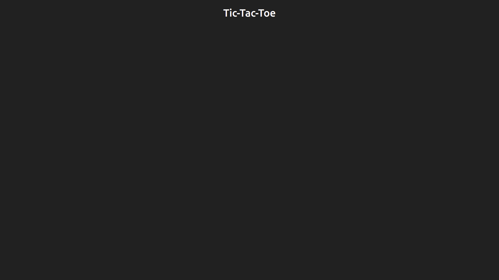

Add Heading in header

```html
App.tsx

<header>
  <h1 className="text-white">Tic-Tac-Toe</h1>
</header>
```

Style heading

```css
header {
  /* ... */

  /* allow content to flex as they want (using flex to align heading) */
  display: flex;

  /* Horizontal align content center */
  justify-content: center;

  /* Vertical align content middle */
  align-items: center;
}
```

Next open [Main](./Main.md)

Current Status of app



